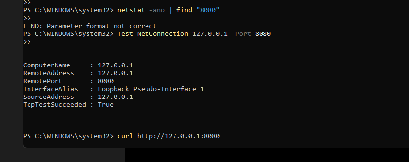
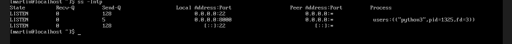
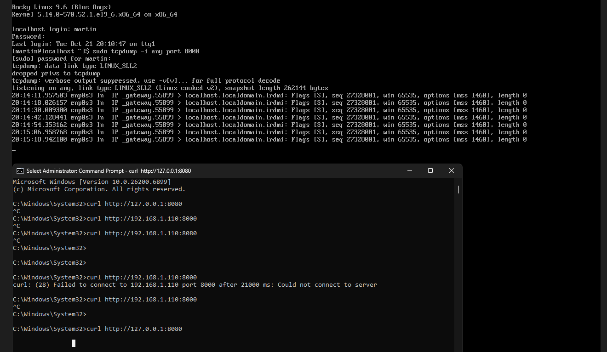
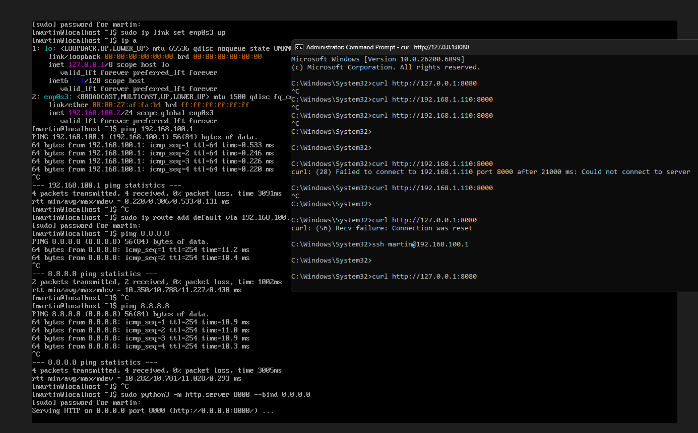
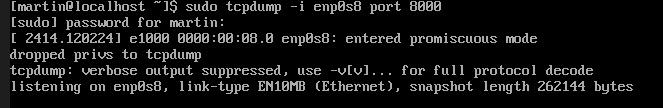
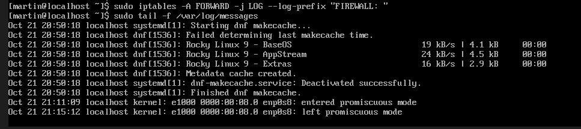
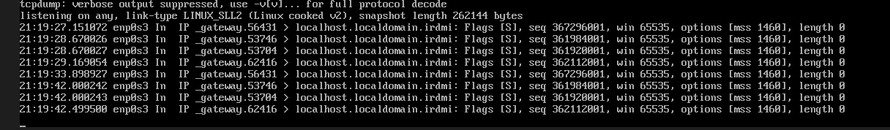
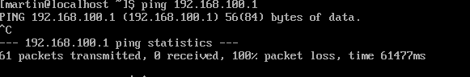
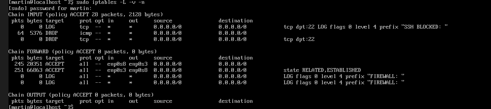

# 🧠 TP Réseau — Accès externe & firewall Linux

## 🎯 Objectifs
- Apprendre à exposer un service d’une VM vers l’extérieur (port forwarding / bridged).  
- Mettre en place un pare-feu Linux qui filtre et journalise le trafic.  
- Comprendre la notion de DMZ et de routage entre hôte, VM et Internet.  

## 🧩 Phase 1 — Préparer une VM accessible depuis l’extérieur

### Situation de départ

Une VM linux, un serveur web (python par exemple).
Le but : Rendre accessible ce service à son binôme via le LAN de l'école

### Indices

- Réfléchir au **mode réseau VirtualBox** : lequel permet que d’autres machines voient la VM ?

le mode NAT 


- Si le mode NAT ne suffit pas, que faut-il faire ?  

du port forwarding


- Qu’est-ce qu’un “port” et comment le rediriger ?

dans une adresse ip un port est celui qui vient ouvrir d'autre services a cette meme adresse donc services différents, et la redirection de port c'est une règle qui fait passer les connexions venant d’un port d’une machine vers une autre machine du réseau interne


- Sur la machine hôte (Windows/macOS/Linux), il y a une interface “physique” : comment s’assurer que la VM y est visible ?

faut qu'elle soit dans le même réso

- Comment tester si le service est bien accessible (outil : navigateur, curl, ping, nmap ?)  



j'ai tester tout ce qui était possible j'ai bien une réponse comme quoi la connection s'est faite mais rien ne s'affiche (sinj)


- Comment vérifier si la connexion arrive dans la VM (log serveur, netstat, ss ?)  





c'est tout ce que je peux faire pour prouver qu'il y a une requête étant donné que le site ne s'ouvre pas et ce sur mac comme windows (j'ai essayé de jouer avec le pare feu rien) 

### Résultat attendu
- Le binome peut taper dans son navigateur l’adresse IP LAN de son collegue et voir la page web hébergée dans sa VM.  
- Le service est fonctionnel et isolé.

## 🧩 Phase 2 — Ajouter un pare-feu / routeur Linux en frontal

### Nouvelle architecture

```bash
[Machine hôte] → [VM Firewall/Routeur] → [VM Serveur web]
```

### Indices

- Comment faire pour que le trafic puisse passer du réseau “externe” vers le réseau “interne” ?  

sudo sysctl -w net.ipv4.ip_forward=1

echo "net.ipv4.ip_forward = 1" | sudo tee -a /etc/sysctl.conf
sudo sysctl -p

sudo iptables -t nat -A POSTROUTING -o enp0s3 -j MASQUERADE

sudo iptables -A FORWARD -i enp0s8 -o enp0s3 -j ACCEPT
sudo iptables -A FORWARD -i enp0s3 -o enp0s8 -m state --state ESTABLISHED,RELATED -j ACCEPT

- Comment une machine peut-elle filtrer des paquets selon leur destination ou protocole ?  

sudo iptables -A INPUT -p icmp -j DROP

sudo iptables -A INPUT -p tcp --dport 22 -j DROP

sudo iptables -A FORWARD -i enp0s8 -p tcp --dport 8000 -j ACCEPT

sudo iptables -P FORWARD DROP

- Comment un pare-feu peut “enregistrer” les connexions (logs) ?  

sudo iptables -A FORWARD -j LOG --log-prefix "FIREWALL: "

sudo tail -f /var/log/messages

sudo journalctl -f


- Comment vérifier que les logs montrent bien les connexions entrantes ?  

sudo tcpdump -i any port 8000

ss -lntp | grep 8000

sudo tail -f /var/log/messages

curl http://127.0.0.1:8080 ou curl http://"ip vmfirewall":8000


- Que faut-il changer dans VirtualBox pour que le serveur web reste accessible via le firewall ?

Il faut connecter les deux VMs sur le même réseau interne et faire passer tout le trafic par la VM firewall donc firewall = deux cartes NAT-Internet Internal Network et serv une carte internal network 

### Résultat attendu

- Le site reste accessible depuis l’extérieur, **mais** le trafic passe désormais par la VM Firewall. 





ça comme tout à l'heure lors de la première demonstration je reçois tout mais je ne peux pas ouvrir la page 

- Le firewall **log** les connexions entrantes et peut bloquer certaines tentatives (par exemple ping ou SSH). 





encore une fois du au faite que je puisse pas ouvrir et donc recevoir pleinement le paquet bah ça bloque mais sur le deuxième screen on voit bien que les paquets arrivent sur le firewall donc.. 

^

preuve que le firewall bloque le protocole ICMP (je suis parti pisser c'est pour ça y'a 10000 paquets transmis)


 et la on voit que les connections ssh sont aussi refuser (alors elle le serait de base étant donné que la config fait son kk nerveux mais la commande est la mdrrr)
## 🧩 Phase 3 — Analyse & durcissement

### Indices
- Comment savoir si le firewall bloque ou autorise une requête ?  

sudo iptables -L -v -n 




- Comment prouver que la connexion passe par la VM Firewall ?  

avec tcpdump comme vu avant 


- Comment autoriser seulement HTTP/HTTPS mais pas SSH ? 

sudo iptables -F = vider les règles en places 

sudo iptables -P INPUT DROP
sudo iptables -P FORWARD DROP
sudo iptables -P OUTPUT ACCEPT = tout bloquer par défaut 

sudo iptables -A INPUT -p tcp --dport 80 -j ACCEPT
sudo iptables -A INPUT -p tcp --dport 443 -j ACCEPT = autoriser http et https

sudo iptables -A INPUT -i lo -j ACCEPT = autoriser les con locales 

au final http https -> ok / ssh -> pas ok (con timed out)

- Quelles commandes permettent de visualiser les compteurs de paquets ou les logs ? 

sudo iptables -L -v -n pour compteurs 

sudo tail -f /var/log/messages pour les logs 


- Comment tester un pare-feu (scan de ports, ping, curl, etc.) ? 

avec un ping pour: verif si le pare-feu autorise ou bloque l’ICMP

http pour verif: que le service web reste accessible

https pour tester les connexions sécurisées

ssh  échoue -> port 22 bloqué 

scan complet avec nmap -p 1-1024 et l'ip que l'on veut target en loccurence ici le firewall et ça montre les ports ouverts/fermés par le pare-feu

## 🧩 Phase 4 — Observation et rapport (BONUS)
Chaque binôme doit :
- faire un schéma de son architecture (interfaces, IPs, modes réseau) ;  

                ┌─────────────────────── PC hôte (Windows) ────────────────────────┐
                │                                                                   │
                │  Port-forward (VirtualBox NAT) : 127.0.0.1:8080 → FW:8000        │
                └───────────────────────────────┬───────────────────────────────────┘
                                                │  (NAT / “external”)
                                      enp0s3    │    IP: 10.0.2.15
                                        ▼       │
                           ┌──────────────────────────────┐
                           │           VM FIREWALL        │
                           │   IP Forwarding: ON          │
                           │   NAT (MASQUERADE)           │
                           │   DNAT 8000 → 192.168.100.2  │
                           └─────────────┬────────────────┘
                                         │  (Internal Network: `intnet1`)
                               enp0s8    │    IP: 192.168.100.1/24
                                         ▼
                           ┌──────────────────────────────┐
                           │          VM SERVEUR          │
                           │  enp0s3: 192.168.100.2/24    │
                           │  Route par défaut: 192.168.100.1
                           │  Service HTTP: :8000         │
                           └──────────────────────────────┘

- indiquer les ports ouverts et leur fonction ;  

serv = 8000 Proto = TCP Service Web Python Serv

Firewall = 8000 Proto = TCP Destination NAT trafic reçus redirigé vers 192.168.100.2:8000 

Host = 8080 Proto = TCP Port-Forward vers 8000 


- expliquer comment ils ont testé la connectivité ;  

python3 -m http.server 8000 --bind 0.0.0.0

sudo sysctl -w net.ipv4.ip_forward=1
echo "net.ipv4.ip_forward = 1" | sudo tee -a /etc/sysctl.conf
sudo sysctl -p = activer routage ip 

sudo iptables -t nat -A POSTROUTING -o enp0s3 -j MASQUERADE

masquerade pour que l’interne sorte via enp0s3

sudo iptables -A FORWARD -i enp0s8 -o enp0s3 -j ACCEPT
sudo iptables -A FORWARD -i enp0s3 -o enp0s8 -m state --state ESTABLISHED,RELATED -j ACCEPT

 autoriser interne → externe et les retours

 sudo iptables -t nat -A PREROUTING -i enp0s3 -p tcp --dport 8000 \
  -j DNAT --to-destination 192.168.100.2:8000

  ce qui arrive sur 8000 est redirigé vers le serveur

  test pc host = curl http://127.0.0.1:8080


- montrer un extrait de log prouvant le passage du flux via le firewall ;  

sudo iptables -I FORWARD 1 -j LOG --log-prefix "FIREWALL: " = la règle 

sudo tail -f /var/log/messages = lire les logs


- proposer **au moins une règle de sécurité** ajoutée à la configuration (ex. blocage ping ou SSH).

bloquer ssh sur le firewall avec log 

sudo iptables -I INPUT 1 -p tcp --dport 22 -j LOG --log-prefix "SSH BLOCKED: "
sudo iptables -A INPUT -p tcp --dport 22 -j DROP

bloquer le ping sur le firewall: 

sudo iptables -A INPUT -p icmp -j DROP

autoriser que http/https: 

sudo iptables -P INPUT DROP
sudo iptables -A INPUT -p tcp --dport 80  -j ACCEPT
sudo iptables -A INPUT -p tcp --dport 443 -j ACCEPT
sudo iptables -A INPUT -i lo -j ACCEPT


## ✅ Résultat final attendu
Un mini-système fonctionnel et observable :  
- Hebergement d'un service réel,  
- Service accessible à d’autres,  
- Protection du service et log du trafic **en n’utilisant que du Linux et VirtualBox**.

Hébergement d’un service réel serv python sur 192.168.100.2

accessibilité contrôlée accès via curl http://127.0.0.1:8080

protection: 

La VM firewall effectue le NAT (sortie) et le DNAT (entrée).

Les logs iptables prouvent le passage du flux (externe && interne).

Des règles de sécurité ssh ICMP montrent la capacité de filtrage